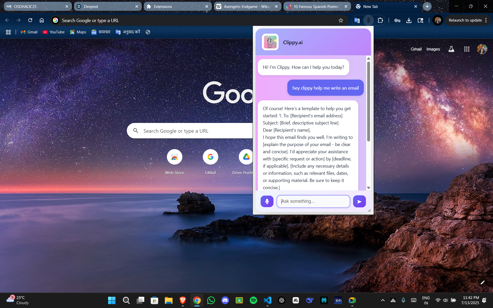
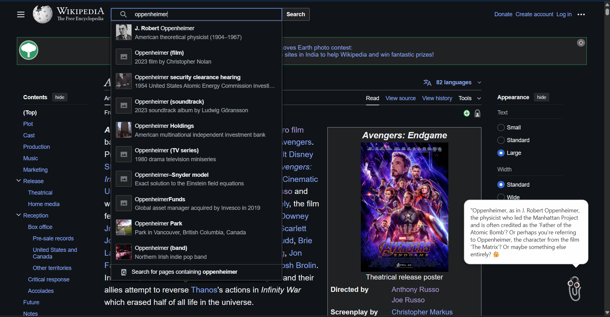
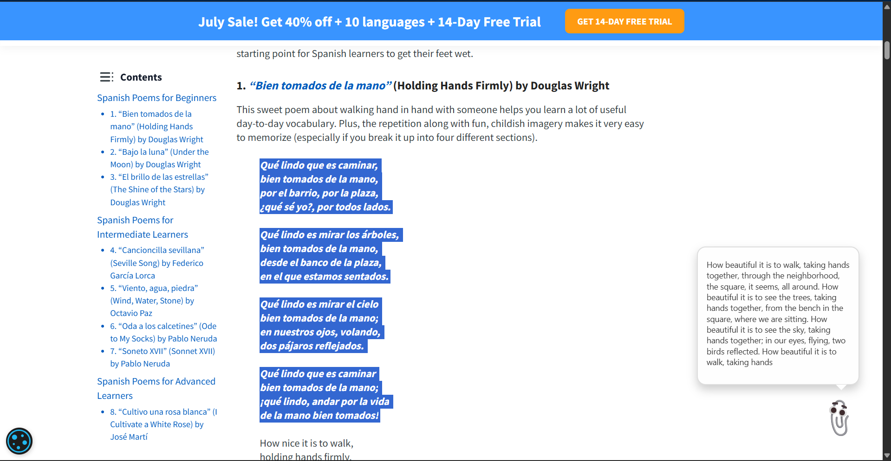
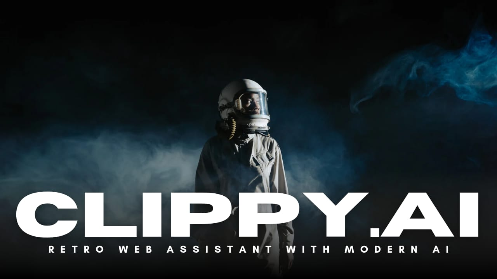

# 🧷 Clippy.ai — Your Retro Web Assistant with Modern AI

**Clippy.ai** brings back the nostalgic charm of the old Microsoft Office paperclip — but this time, powered by GPT and living right in your Chrome browser.

🧠 **AI-Powered** , 🎨 **Retro-Styled** , 🌐 **Runs on Any Website**

---

## 🚀 **Features**

🗨️ **Smart Assistant**
- Floating Clippy on every webpage
- Chat with GPT-based AI (OpenAI, Groq, Together)
- Voice input via Web Speech API
- Context-aware replies

🧠 **Text Enhancements**
- Auto-summarizes or translates selected text
- Gives quirky reactions or suggestions

🎨 **Nostalgic + Modern UI**
- Retro Clippy avatar with modern chat UI
- Animated typing indicator
- Dark/light theme ready (coming soon!)

💡 **Open & Extensible**
- Fully open source
- Easy to customize
- Fast and lightweight

---

## 🖼️ **Demo**

### **Demo Screenshots**





### **Demo video -**
[](https://www.youtube.com/watch?v=Cx55-KWhemE)

---

## 🛠️ **Tech Stack**

| Area                  | Tools Used                   |
|-----------------------|------------------------------|
| Extension Framework   | Chrome Manifest v3           |
| Assistant Logic       | OpenAI / Groq / Together API |
| UI & Animations       | HTML, CSS, JavaScript, Node JS, Express JS        |


---

## 📦 **Installation**

1. **Clone this repository**
   ```bash
   git clone https://github.com/yourusername/clippy-ai
   cd clippy-ai
   ```

2. **Install node modules in your root directory by this command:**
    ```bash
    npm install
    ```

3. **Create a `.env` file in the root folder.**

4. **Paste your API key, model and fetch url like this in the .env file:**
   ```bash
    API_KEY=your_actual_api_key_here
    MODEL=your_api_key_model_here
    FETCH=your_full_api_endpoint_here
    ```

5. **Turn the server on:**
    ```bash
    npm run dev
    ```

6. **Load the Extension in Chrome**
   - Go to chrome://extensions
   - Turn on Developer Mode
   - Click Load Unpacked
   - Select the Clippy.ai/ folder

✅ That's it! Open any site - and Clippy will be there, ready to help.
_(Do check the permissions for the extensions)_

---

## 📁 **Project Structure**
``` bash
    Clippy.ai/
    ├── manifest.json         # Chrome extension config
    ├── package.json          # Project dependencies and scripts
    ├── package-lock.json     # Locks the scripts installed
    ├── content.js            # Injects Clippy into all pages
    ├── clippy.js             # Logic handling for chats
    ├── clippy.html           # Chat UI layout
    ├── clippy.css            # Styling
    ├── server.js             # Connection
    ├── clippy-assets/        # Clippy images
    │   ├── clippy-idle.gif
    │   └── clippy-thinking.gif
    ├── icons/                # Clippy icons
    ├── demo/                 # Demo images
    ├── README.md
    └── LICENSE
```

---

## 🧑‍💻 **Contributing**

This project is _open source_ under the **MIT license**. Contributions, forks, and memes are welcome!

- Want to add custom personalities? Voice features? More retro animations?
- Open a pull request or file an issue 🙌

---

## 🧾 **License**

This project is licensed under the _**MIT License**_.

---

## ✨ **Credits**

Original Clippy inspiration: _Microsoft Office Assistant (1997–2003)_

---

## 💡**Built at a Hackathon**

_**Clippy.ai**_ was created by _ByteForge_ during _**OSDHack'25**_ because everyone deserves a helpful paperclip again 🧷
